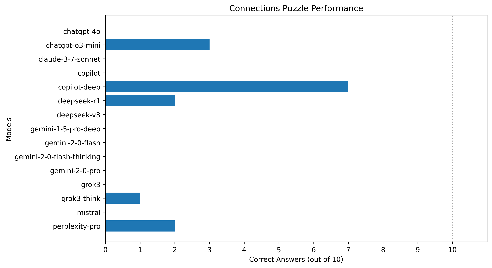

# Connections LLM Benchmark

A few months ago I've become addicted to Connections, the NYT game where you have to group 16 words into 4 groups based on often puzzling connections. Quite a few times I became frustrated trying to solve a puzzle and thought I'd try Gemini or ChatGPT to help me. That's when I've noticed that LLMs seem to generally be completely useless at this task. The natural conclusion was that this would be a wonderful ad-hoc benchmark for LLMs, especially the new ones that feign "reasoning".

As of today, 12th of March 2025, I've run a test with the past 10 days worth of puzzles. The supporting files and results can be found in this repo.

Without further ado, here are the results:

I was quite shocked that Copilot performed the best, and pleasantly surprised that DeepSeek R1 did quite well for a free model. As a heavy Gemini user, I can't say I was suprised by its utter inability to make any meaningful progress.

Fun fact, some models completely failed to even produce the requested output format:

- Microsoft Copilot (non deep)
- ChatGPT (4o) - mostly produced 4 lines instead of 1
- Grok V3 (deep) - produced a table
- Mistral - Capitalized Words For No Reason
- Gemini 2.0 Pro - Capitalized words and sometimes produced 4 lines instead of 1
